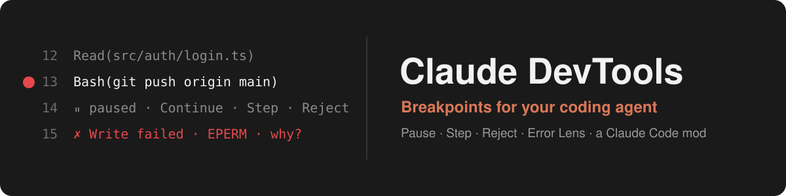

<p align="center">
  
</p>

<h1 align="center">Claude DevTools</h1>

<p align="center">
  <strong>Breakpoints for your coding agent. Stop it before it runs <code>git push</code>. See why its last call failed.</strong>
</p>

<p align="center">
  <sub>A Claude Code mod that works like a debugger for tool calls: breakpoints on tools, commands, files and errors · Continue, Step and Reject · a live dashboard · Error Lens failure diagnosis. Everything stays on your machine.</sub>
</p>

<p align="center">
  <a href="https://github.com/NMenzel/claude-devtools-mod/stargazers"></a>&nbsp;
  <a href="https://github.com/NMenzel/claude-devtools-mod/releases/latest"></a>&nbsp;
  <a href="LICENSE"></a>&nbsp;
  <a href="https://claude.com/blog/claude-code-mods"></a>&nbsp;
  
</p>

<p align="center">
  <a href="#install">Install</a> · <a href="#use-it">Use it</a> · <a href="#error-lens-why-a-tool-call-failed">Error Lens</a> · <a href="#commands">Commands</a> · <a href="#options">Options</a> · <a href="docs/SECURITY.md">Security</a>
</p>

---

## The problem

**Claude Code acts on its own, one tool call after another.** Permission rules
decide *whether* a call may run. They don't let you stop the agent at a point
you choose, look at what it is about to do, and step through it.

- **No breakpoints.** You can't say "stop before any `npm publish`", "stop whenever it touches `src/auth/**`" or "stop on the next call after a failure", then decide with the full call in front of you.
- **Failures are one line.** `EPERM: operation not permitted` scrolls past. Was the file locked? Did the parent folder exist? Did the write land anyway? Claude retries, and you guess.
- **No record.** What ran, in what order, which permission rule applied, and what failed is spread across the scrollback.

## The solution

**Claude DevTools is a debugger for the agent's tool level**, built on Claude Code's native Mods API.

| In Claude Code today | With Claude DevTools |
| --- | --- |
| A permission prompt per call, allow or deny | **Breakpoints** on tools, command patterns, path globs and failures. **Continue**, **Step** (pause on the next call too) or **Reject** with a note Claude reads |
| `Bash(npm test)` in the transcript | A **"break on" gutter** under every tool row, like clicking a line number in Chrome DevTools, plus a one-key bar above the prompt |
| `Error: EPERM: operation not permitted` | **Error Lens**: the kind of failure, what is ✔ confirmed, ? possible or · unknown, each with its evidence, read-only file checks, and fixes to try |
| The same error, again and again | Repeats **grouped** and counted. A notification for the first, then every fifth |
| Scrollback | A **timeline** and **inspector**: status, duration, agent, permission verdict and breakpoint of every call |
| Copying from the terminal | **Sanitized exports**, versioned JSON and Markdown, with secrets redacted and file contents omitted |

**Native mod. No wrappers, no API keys, no network calls, no model calls. Two commands to install.**

It works at the tool level only. It does **not** show hidden reasoning, model
internals or token-level steps. It sees what the Mods API exposes: each tool
call's name, arguments, agent, permission verdict and result. It never
approves anything: Claude Code's permission rules still decide after you
press Continue.

> [!TIP]
> If Claude DevTools saves you a bad `git push` or an hour of guessing at an error, **a ⭐ on the repo** helps other developers find it.

Claude DevTools is a community project. It is not made or endorsed by Anthropic.

## Requirements

- Claude Code with Mods support. Built and tested on **2.1.294** (Windows 10). Mods need 2.1.287 or later, and builds older than 2.1.294 are untested.
- The pane draws in the terminal and in the Code tab of Claude Desktop. In
  the VS Code chat panel and in `claude -p` the hooks run but nothing is
  drawn; use the `/devtools-*` commands there.

## Install

Inside Claude Code:

```text
/plugin marketplace add NMenzel/claude-devtools-mod
/plugin install agent-devtools@claude-devtools-mod
/reload-plugins
/devtools
```

<details>
<summary><strong>From the terminal, or from a clone</strong></summary>

```sh
claude plugin marketplace add NMenzel/claude-devtools-mod
claude plugin install agent-devtools@claude-devtools-mod
```

Or load it straight from a clone, for one session:

```sh
git clone https://github.com/NMenzel/claude-devtools-mod
claude --plugin-dir ./claude-devtools-mod
```

</details>

The installer may say config options aren't set. The defaults are fine, and
[`/config`](#options) changes them. Mods are an early-access Claude Code
feature, and their API can change between releases.

On Windows with Git Bash, pass a native path (`C:/Users/you/claude-devtools-mod`).
When you type a slash command as a `claude -p` prompt in Git Bash, set
`MSYS_NO_PATHCONV=1` first. Otherwise Git Bash rewrites `/devtools-status`
into a Windows path.

To load it in every session without the flag, add the folder to
`CLAUDE_CODE_PLUGIN_DIRS` in the `env` block of `~/.claude/settings.json`.
Use an absolute path, and separate several with `;` on Windows or `:` elsewhere.

Check that it loaded: run `/plugin` and look for `agent-devtools` in the
`mods active` line. You can also run `/devtools-help`.

## Use it

```text
/devtools-break command npm install        # pause before any `npm install`
/devtools-break file src/auth/**           # pause before reading/editing auth code
/devtools-break tool Write,Edit --action warn
/devtools-break error Bash --action pause   # after a failed Bash call, pause the next call
/devtools                                   # open the pane
```

When a call matches a pause breakpoint, Claude Code shows a **DevTools**
question with:

| Choice | What happens |
| - | - |
| **Continue** | The call goes on through Claude Code's normal permission checks and runs. |
| **Step** | Same as Continue. Then the next tool call pauses too, one tool call at a time. |
| **Reject** | The tool does not run. Claude is told the developer rejected it and to choose another approach. |
| **Simulate** | Only offered when the `simulation` option is on. The tool does not run. Claude gets a clearly labeled synthetic result (see below). |
| *typed text* | Rejects the call and passes your text to Claude as a note ("use pnpm instead"). |
| Esc / *Chat about this* | Rejects the call ("dismissed"). |

The question dialog is the control for a held call. It holds the call
inside Claude Code's own dialog, so the wait never times out the hook.

### Set breakpoints where the calls are (Chrome DevTools style)

There are three ways to set a breakpoint without typing a rule.

- **The transcript gutter.** Hover a tool row (`Bash(npm test)`, `Read(src/auth/login.ts)`, a folded "Read 3 files, searched 2 patterns" line). It shows `break on: ○ Bash ○ "npm test" ○ src/x.ts`. Press one to set a pause breakpoint on that tool, that command (program and subcommand), or that path. Press it again to remove it. A row that a breakpoint covers gets a red `● breakpoint bp1 …` line. Hover and clicks need a pointer, which means the fullscreen terminal or Claude Desktop. Set the `inlineControls` option to `always` to keep the controls on a line of their own.
- **The bar above the prompt.** It shows the latest call: `DevTools ✓ Bash git push origin main · break on ○ Bash ○ "git push" · DevTools · hide`. Press ctrl+x tab to focus it, then `t` for the tool, `c` for the command, `f` for the path, `d` to open the dashboard and `x` to hide it. When that call failed, `e` (`✗ why?`) opens its Error Lens. This works on every terminal layout, keyboard only.
- **Category toggles**, like Chrome's event-listener breakpoints: `pause on ■ Shell □ Read □ Search □ Edit □ Web □ Agents`. They are on the dashboard and the Breakpoints tab, and each one adds or removes a tool breakpoint for the whole family.

The Inspector has the same `break on` buttons for any recorded call, on keys `1` `2` `3`.

### The dashboard

`/devtools` opens the dashboard, a flightdeck-style pane. It also opens by
itself when an interactive session starts in a terminal at least 144 columns
wide (set `openOnStart` to false to stop that).

- **Header**: `CLAUDE DEVTOOLS · ● active · ⏺ recording · 3 breakpoints · ⏸ 1 paused`, and a color legend (ok, failed, denied, simulated, paused).
- **PAUSED / ARMED**: each held call with its tool, summary, breakpoint and time held. When pause-next or step is armed, a Disarm button.
- **BREAKPOINTS**: the category toggles, every rule with its state, match, action and hit count (press a rule to enable or disable it), and the totals.
- **CALLS**: one colored cell per call (green ok, red failed, amber denied, purple simulated), the totals, and counts per family (shell, read, search, edit, web, mcp).
- **ERRORS** (only after a failure): the latest kinds of failure, repeats counted (`✗ 3× Bash · exit-code · npm ERR! …`). Press one to open its Error Lens.
- **TIMELINE**: the newest calls. Press one to inspect it.
- **Actions**: `p` pause next call, `r` recording, `m` cycle mode, `s` export.

Docked from 110 columns it lays out two columns (rules and calls on the
left, the timeline on the right). Narrower, it stacks. Inline above the
prompt (main-screen terminal) it is a three-line summary.

The tabs (`d` `t` `i` `b` `e`; ctrl+x tab focuses the pane, Tab walks its controls):

- **Dashboard**: as above.
- **Timeline**: newest-first tool calls with status, tool, duration and summary. A `●` marks calls that matched a breakpoint. `j`/`k` page, `x` clear. Press a row to inspect it, or the ` why?` beside a failed row to open its Error Lens.
- **Inspector**: the selected call's id, session, agent, timestamps, risk, permission verdict, breakpoint and decision, synthetic flag, result, error, and redacted input (JSON). `break on` buttons on `1`/`2`/`3`, `h`/`l` older/newer, and on a failed call `w` "Why it failed".
- **Breakpoints**: the mode picker, the category toggles, each rule with Enable/Disable and Delete, and a field that adds a rule in the same language as `/devtools-break`.
- **Errors**: Error Lens (below). The tab label counts the failures kept.

### Error Lens: why a tool call failed

Error Lens watches every tool call that fails (Bash, PowerShell, Read, Write,
Edit, Grep, Glob, web and MCP tools) and explains the failure from evidence.
It is passive: it never retries a call, changes a result, asks a model or
interrupts you, and its file checks run after the result has gone back to
Claude. It is on by default (`errorLens`).

For each failure it keeps:

- **the original error**, as Claude read it (redacted, up to 3,000 characters), with its code (`ENOENT`, `EACCES`, `EPERM`, ...) or shell exit code;
- **the call**: the arguments (sanitized, file contents omitted), the agent, the duration and the permission verdict;
- **a category**: not-found, access-denied, not-permitted, busy, stale-read (the file changed since Claude read it), not-read-yet, edit-mismatch, timeout, command-not-found, exit-code, network, mcp, permission-denied, blocked-by-hook, input-invalid, too-large, unknown, and more;
- **causes, sorted by certainty**:
  - `✔ CONFIRMED`: the result text, a permission verdict or a file check shows it. The evidence (the quoted line, the verdict, the observed file) is shown under it.
  - `? POSSIBLE`: a known explanation the evidence does not prove (another program holding the file, CRLF line endings, a sandbox).
  - `· UNKNOWN`: what cannot be determined from here (which hook refused, permission bits, which process changed a file).
  When no signature matches, it says the cause is unknown. It never guesses past the evidence.
- **read-only checks** (the `probe` mode, the default): after the result has gone back to Claude, one `stat` per path. It checks the target file, its parent folder and paths the error names: whether each exists, what kind it is, its size, its modification time and whether it is a link. So it can say "the parent directory /work/new does not exist", or that a Write reported an error but the file changed during the call and has exactly the intended size, so the write may have landed. It never reads file contents.
- **fixes** to try, as a numbered list.

Repeats of one failure (same tool, kind and message with paths and numbers
masked) are **grouped** and counted. A one-line notification announces the
first failure of each kind and then every fifth repeat:
`DevTools ✗ Read failed (not-found): ENOENT: no such file … · /devtools-errors to inspect`.
DevTools' own refusals, simulations and interrupted calls are kept but never announced.

Ways to reach it: the **Errors** tab (`e`), the dashboard's ERRORS panel, ` why?` on a failed timeline row,
`w` in the Inspector, `e` on the bar above the prompt, or `/devtools-errors`, which prints the
same report as text and works headless too. `/devtools-errors clear` empties it. Exports include
every Error Lens record and group, and the Markdown report has an Error Lens section.

An MCP tool that reports success but whose output begins like an error (`Error: …`; some
servers answer errors as plain text) is kept as `suspected`, with its cause marked possible.
Built-in tools flag their own errors, so they are never judged this way.

### Commands

| Command | Does |
| - | - |
| `/devtools` | Open the pane (in a headless session: print the status) |
| `/devtools-status` | Debugger state and the last few events, as text |
| `/devtools-break <rule>` | Add a breakpoint. `/devtools-break delete <id>`, `toggle <id>`, `enable <id>`, `disable <id>`, `clear` |
| `/devtools-list` | List breakpoints with ids and hit counts |
| `/devtools-pause` | Pause on the next tool call |
| `/devtools-continue` | Disarm pause-next and stepping (a call already held is answered in its dialog) |
| `/devtools-disable [observe\|off]` | `observe` (default): breakpoints record but never pause. `off`: no interception, no recording |
| `/devtools-enable` | Back to `active`: breakpoints pause |
| `/devtools-record [on\|off]` | Record every call, or only breakpoint matches |
| `/devtools-errors [clear]` | Error Lens: the failure kinds this session and the latest failure's diagnosis. Opens the Errors tab when interactive |
| `/devtools-export [path.json\|path.md] [--md]` | Write a sanitized JSON trace (and a Markdown report). Default: `.claude-devtools/trace-<time>.json` in the working directory |
| `/devtools-help` | Usage and the rule language |

All of these run immediately, even while Claude is working.

### Rule language

```text
tool <Name>[,<Name>...]            every call to these tools (MCP tools by full name: mcp__github__create_issue)
command <pattern>                  shell command contains the words, in order; * is a wildcard; re:<regex> for a regex
file <glob>                        a call names a matching path: src/auth/**, prisma/schema.prisma, .env*
error [<Tool>,...]                 after a failed call (default action warn; --action pause arms the next call)
when tool=A,B command=".." path=.. all given conditions must match

--action pause|record|warn   --scope all|main|subagents   --name "..."
--after <N>   act from the Nth hit (hit counts reset each session)
--simulate fail|stub  --text "..."   what Simulate answers at this breakpoint
--disabled
```

Path globs are case-insensitive whenever either side is a Windows path.
A glob with no `/` matches any path segment. A relative glob matches below
the working directory or at any directory boundary.

### Simulation (opt-in)

Simulation is off by default. Turn on the `simulation` option first. **Simulate**
then appears only for allowlisted tools (Bash, PowerShell, Read, Edit,
Write, NotebookEdit, Glob, Grep, WebFetch, WebSearch, and MCP tools):

- `fail` (default): the call is refused with
  `[Claude DevTools · SIMULATED FAILURE] <text> The <tool> call was NOT executed, so nothing changed.`
- `stub`: only for shell commands classified **read-only**. It returns stdout
  starting with `[Claude DevTools · SIMULATED OUTPUT: the command was NOT executed]`.

A simulated call never reaches the real tool. The timeline, inspector and
exports mark it `simulated`.

### Headless (`claude -p`, SDK)

Nobody can answer a question there, so nothing waits. A call that matches a
**pause** breakpoint is rejected with an explanation, and calls that match
nothing run normally. To record such calls and let them through instead, set
`headlessPause` to `record-only`.

## Options

Set them in `/config`, or under `pluginConfigs["agent-devtools@inline"].options`
in `~/.claude/settings.json` for a `--plugin-dir` load:

| Option | Default | Meaning |
| - | - | - |
| `recording` | `true` | Record every call (until a saved preference exists) |
| `maxTimelineEntries` | `500` | Ring buffer size, 10 to 5000 |
| `maxSummaryChars` | `160` | Longest input/result summary, 40 to 2000 |
| `defaultScope` | `all` | Scope of new rules: `all`, `main` or `subagents` |
| `headlessPause` | `reject` | `reject` or `record-only` |
| `simulation` | `false` | Offer Simulate at breakpoints |
| `redaction` | `true` | Redact credentials, tokens and environment values |
| `captureRaw` | `false` | Also keep raw inputs/outputs (truncated). **Privacy risk**: may capture file contents |
| `persistBreakpoints` | `true` | Save rules and mode in the plugin store across sessions |
| `inlineControls` | `hover` | The transcript gutter and the bar above the prompt: `hover`, `always` (gutter on its own line) or `off` |
| `openOnStart` | `true` | Open the dashboard when an interactive session starts (seated unasked only from 144 columns) |
| `errorLens` | `probe` | `probe`: diagnose failures and check the paths involved (stat only). `classify`: from the result alone, no file system access. `off` |
| `errorToasts` | `true` | Notify on a failure: the first of each kind, then every fifth repeat |

## Develop and test

```bash
npm install                      # local TypeScript only; nothing global
claude plugin validate .         # manifest, hooks, calls, state contract
claude plugin test .             # 143 tests: pure engine + real hooks and UI through claude-code/testing
npx tsc -p .                     # type-check (after one load has laid .claude-plugin/types)
```

The engine writes `.claude-plugin/types/` the first time it loads the
folder. To lay it without starting an interactive session, run once:
`claude -p --plugin-dir . "/devtools-help"`.

See [docs/ARCHITECTURE.md](docs/ARCHITECTURE.md), [docs/API-COMPATIBILITY.md](docs/API-COMPATIBILITY.md),
[docs/SECURITY.md](docs/SECURITY.md) and [docs/LIMITATIONS.md](docs/LIMITATIONS.md).
[CONTRIBUTING.md](CONTRIBUTING.md) has the ground rules; changes are listed in [CHANGELOG.md](CHANGELOG.md).

## Related projects

- [Flightdeck](https://github.com/scasella/claude-flightdeck): a live agent dashboard for Claude Code. DevTools' dashboard follows its panel style. Use both: Flightdeck watches the agents, DevTools stops and explains their tool calls.
- [claude-devtools](https://github.com/matt1398/claude-devtools): a different project with a similar name, a visual app for Claude Code session logs.
- [awesome-claude-code-mods](https://github.com/karanb192/awesome-claude-code-mods): the index of Claude Code mods.

## License

[MIT](LICENSE)
